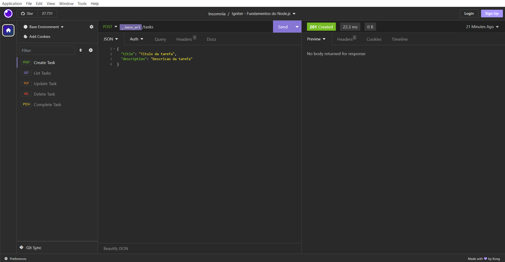

<h1 align="center">
  
</h1>

<h3 align="center">
  Desafio: Fundamentos do Node.js
</h3>

<p align="center">Essa API em Node.js realiza o gerenciamento completo de tarefas (CRUD). As funcionalidades essenciais incluem a criação, listagem com filtros por título e descrição, atualização, remoção e a marcação de tarefas como concluídas.</p>

<p align="center">
  <a href="#como-executar-o-projeto">Como executar o projeto</a>&nbsp;&nbsp;&nbsp;|&nbsp;&nbsp;&nbsp;
  <a href="#sobre-o-desafio">Sobre o Desafio</a>
</p>

<p align="center">Back-end</p>

<p align="center">
  
</p>

## Como executar o projeto

### Requisitos

- [Node.js](https://nodejs.org) na versão 22.21.1
- [Yarn](https://yarnpkg.com) na versão 1.22.5

#### Opcional

- [Insomnia](https://insomnia.rest)

### Passos para a execução

**1. Executar aplicação**

Instalar as dependências do projeto

```bash
yarn
```

Iniciar o servidor de desenvolvimento

```bash
yarn dev
```

A aplicação começará a ser executada em http://localhost:3333

_Dica: utilizar o Insomnia para testar as rotas_

- Abrir o Insomnia -> Application -> Preferences -> Data -> Import Data -> From File -> Selecionar o arquivo insomnia.json

## Sobre o desafio

O desafio consiste na criação de uma API em Node.js para gerenciar tarefas. O principal objetivo é aplicar os conceitos de CRUD (Create, Read, Update, Delete).

### Estrutura de uma Tarefa

Cada tarefa deve ser composta pelas seguintes propriedades:

- `id`: Um identificador único para cada tarefa
- `title`: O título da tarefa
- `description`: Uma descrição detalhada da tarefa
- `completed_at`: A data de conclusão da tarefa, que deve iniciar como `null`
- `created_at`: A data de criação da tarefa
- `updated_at`: A data da última atualização da tarefa, que deve ser alterada a cada modificação

### Regras das Rotas

A API deve possuir as seguintes rotas e regras de negócio:

#### POST `/tasks`

- Cria uma nova tarefa.
- Recebe `title` e `description` no corpo da requisição.
- Os campos `id`, `created_at`, `updated_at` e `completed_at` devem ser preenchidos automaticamente.

#### GET `/tasks`

- Lista todas as tarefas existentes.
- Permite a busca por tarefas, filtrando pelos campos `title` e `description`.

#### PUT `/tasks/:id`

- Atualiza uma tarefa específica pelo `id`.
- Recebe `title` e/ou `description` no corpo da requisição para atualização.
- Antes de atualizar, deve validar se o `id` fornecido corresponde a uma tarefa existente.

#### DELETE `/tasks/:id`

- Remove uma tarefa específica pelo `id`.
- Antes de remover, deve validar se o `id` fornecido corresponde a uma tarefa existente.

#### PATCH `/tasks/:id/done`

- Altera o status da tarefa entre completa e não completa, modificando o campo `completed_at`.
- Antes de alterar, deve validar se o `id` fornecido corresponde a uma tarefa existente.