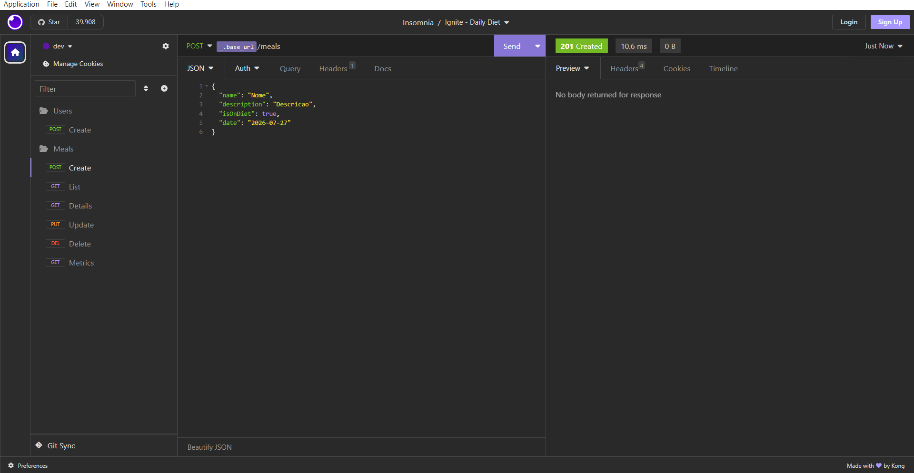

<div align="center">
  
</div>

<h3 align="center">
  Desafio: Daily Diet
</h3>

<p align="center">Criação de uma API para controle de dieta diária utilizando o Node.js</p>

<p align="center">
  <a href="#como-executar-o-projeto">Como executar o projeto</a>&nbsp;&nbsp;&nbsp;|&nbsp;&nbsp;&nbsp;
  <a href="#sobre">Sobre</a>&nbsp;&nbsp;&nbsp;|&nbsp;&nbsp;&nbsp;
  <a href="#anotações">Anotações</a>
</p>

<p align="center">Back-end</p>

<p align="center">
  
</p>

## Como executar o projeto

### Clonar este repositório

```bash
git clone https://github.com/eliasmcastro/rocketseat-ignite-nodejs-daily-diet.git
```

### Requisitos

- [Node.js](https://nodejs.org) na versão 22.21.1
- [Yarn](https://yarnpkg.com) na versão 1.22.5

#### Opcional

- [Insomnia](https://insomnia.rest)

### Passos para a execução

- Instalar as dependências do projeto

  ```bash
  yarn
  ```

- Configurar as variáveis de ambiente no `.env` utilizando o `.env.example`

- Executar as migrations

  ```bash
  yarn knex migrate:latest
  ```

- Iniciar o servidor de desenvolvimento

  ```bash
  yarn dev
  ```

A aplicação começará a ser executada em http://localhost:3333

- Para executar os testes unitários

  - Configurar as variáveis de ambiente no `.env.test` utilizando o `.env.test.example`

  ```bash
  yarn test
  ```

_Dica: utilizar o Insomnia para testar as rotas_

- Abrir o Insomnia -> Application -> Preferences -> Data -> Import Data -> From File -> Selecionar o arquivo insomnia.json

## Sobre

- Deve ser possível criar um usuário
- Deve ser possível identificar o usuário entre as requisições
- Deve ser possível registrar uma refeição feita, com as seguintes informações:
  *As refeições devem ser relacionadas a um usuário.*
  - Nome
  - Descrição
  - Data e Hora
  - Está dentro ou não da dieta
- Deve ser possível editar uma refeição, podendo alterar todos os dados acima
- Deve ser possível apagar uma refeição
- Deve ser possível listar todas as refeições de um usuário
- Deve ser possível visualizar uma única refeição
- Deve ser possível recuperar as métricas de um usuário
  - Quantidade total de refeições registradas
  - Quantidade total de refeições dentro da dieta
  - Quantidade total de refeições fora da dieta
  - Melhor sequência de refeições dentro da dieta
- O usuário só pode visualizar, editar e apagar as refeições o qual ele criou

## Anotações

### Configurando estrutura

- `yarn init -y` inicializa o projeto e cria o arquivo package.json
- `yarn add typescript -D` instala o TypeScript
- `yarn tsc --init` cria o arquivo tsconfig.json, onde ficam as configurações do compilador TypeScript
- `yarn add fastify` instala o Fastify (framework para criar servidores HTTP)
- `yarn add @types/node -D` instala as definições de tipos do Node.js
- `yarn add tsx -D` instala o tsx, para executar arquivos TypeScript sem precisar compilar manualmente antes
- Em `package.json` configurar o comando para executar a aplicação:

  ```json
  "scripts": {
    "dev": "tsx watch src/server.ts"
  }
  ```

### Padrões de Projeto com ESLint e Prettier

O ESLint serve para padronizar o projeto

- `yarn add eslint @rocketseat/eslint-config -D` instala as dependências necessárias
- Criar o arquivo `.eslintrc.json` e adicionar

  ```json
  {
    "extends": [
      "@rocketseat/eslint-config/node"
    ]
  }
  ```

- Em `package.json` configurar o comando para executar o lint:

  ```json
  "scripts": {
    "lint": "eslint src --ext .ts --fix"
  }
  ```

- Instalar a extensão `ESlint` no VSCode
- Abrir o arquivo de configuração do VSCode:
  - `CTRL + SHIFT + P`
  - Pesquisar por `Open User Settings (JSON)`
  - Adicionar `"editor.codeActionsOnSave": { "source.fixAll.eslint": "explicit" }`

### Banco de Dados

- `yarn add knex sqlite3` instala o Knex.js e driver do banco de dados do sqlite
- Em `package.json` configurar o comando para executar o knex:

  ```json
  "scripts": {
    "knex": "tsx ./node_modules/knex/bin/cli.js"
  }
  ```

- `yarn knex migrate:make NOME-MIGRATIONS` cria uma migration
- `yarn knex migrate:latest` executa todas as migrations
- `yarn knex migrate:rollback` desfaz a última execução das migrations

### Variáveis de ambiente

- Criação do .env
- `yarn add dotenv` instala o dotenv

### Validação de dados

- `yarn add zod` instala o zod

### Utilizando cookies no Fastify

- `yarn add @fastify/cookie` instala o @fastify/cookie

### Testes automatizados

- `yarn add vitest -D` instal o vitest

- Em `package.json` configurar o comando para executar os testes:

  ```json
  "scripts": {
    "test": "vitest"
  }
  ```

- `yarn add supertest @types/supertest -D` instal o supertest e suas definições de tipo

### Deploy

- `yarn add tsup` instal o tsup que é uma ferramenta de "bundling"
- Em `package.json` configurar o comando para executar o build:

  ```json
  "scripts": {
    "build": "tsup src --out-dir build",
  }
  ```

- Build Command: `yarn` + `yarn run knex -- migrate:latest` + `yarn run build`
- Start Command: `node build/server.js`
